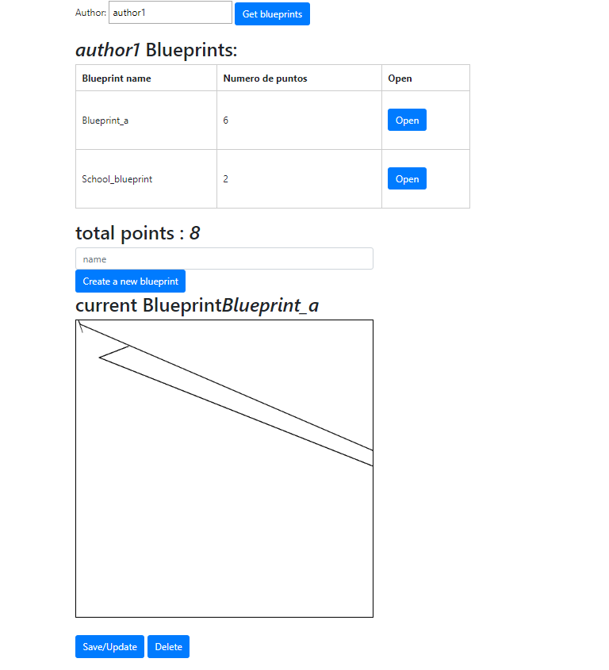

# Lab06-ARSW

# Compile and run instructions

Para ejecutar el proyecto se debe realizar el sigueinte comando

* gradle bootRun

Se debe tener gradle para poder realizar su ejecucion

# Frontend Views

La pagina queda de la siguiente manera 

como se puede ver en la anterior imagen cuando se crea el nuevo blue print debe realizarse al ingresar el nombre superiror

