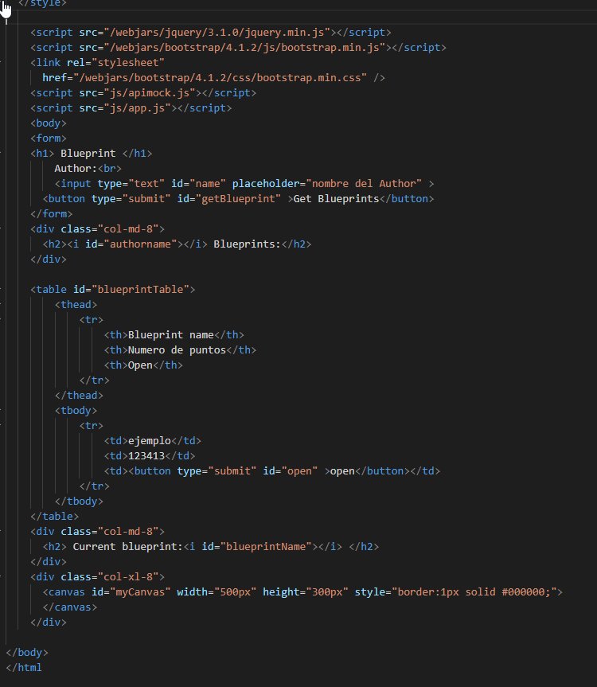
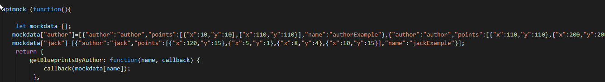
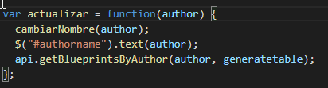
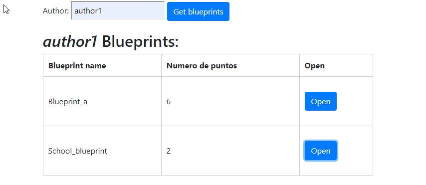
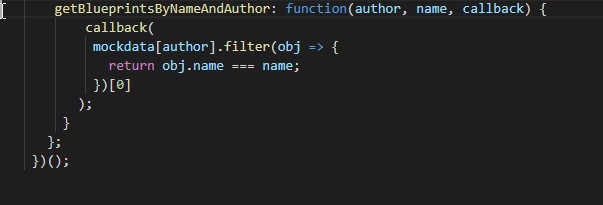
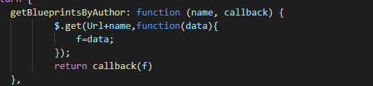
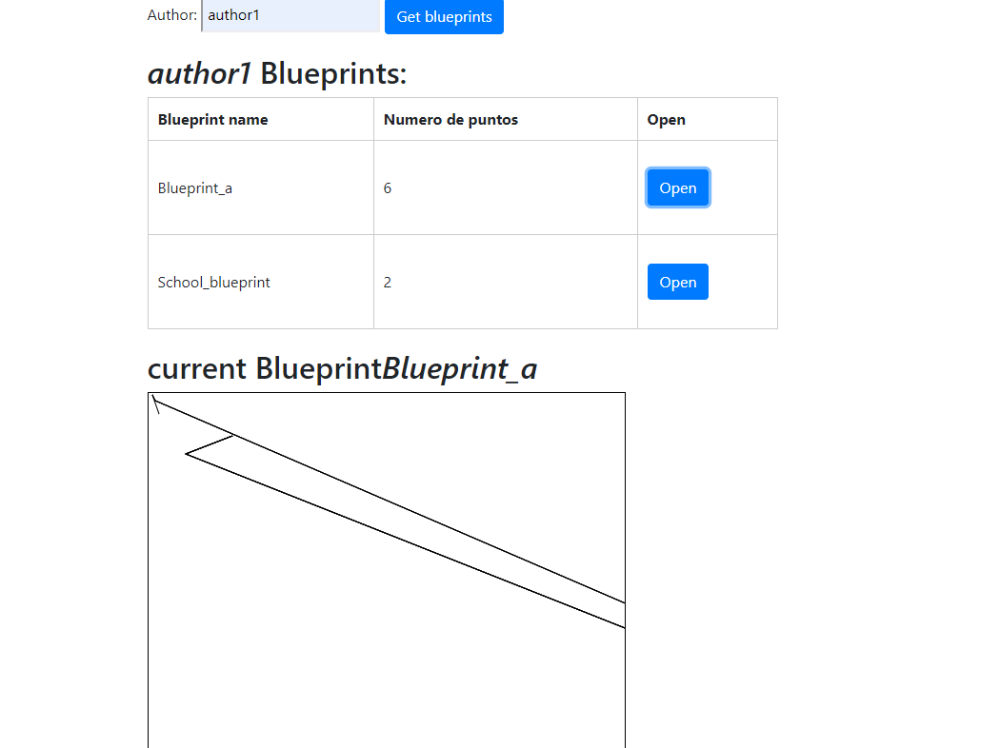

# Lab05-ARSW

# Compile and run instructions

Para ejecutar el proyecto se debe realizar el sigueinte comando

* gradle bootRun

Se debe tener gradle para poder realizar su ejecucion

# Frontend Views

se creo la pagina index.html en base a lo propuesto en el laboratorio

se puede ver en el explorador de la siguiente forma: 

# Frontend Logic

Con el fin de poder ver la funcionalidad de los scripts sin utlizar el back end de la aplicacion se debe realizar el sigueinte archivo:

Ademas la accion que realiza el boton se da gracias a la siguiente funcion

y se puede ver en el explorador de la sguiente manera:

# Next Week

Con el fin de poder obtener los datos de author y el nombre especifico del blue print debemos realizar la siguietne funcion, esta nos sirivira en gran medida para el uso del mock

Consultado por medio de jQuery podremos obtener los datos que se encuentran desde la aplicacion de blueprints, una de las formas de realizar la comunicacion
se muestra en la siguiente imagen:

y el dibujo del canvas ya conectada con la aplicacion se ve de la siguiente manera 

